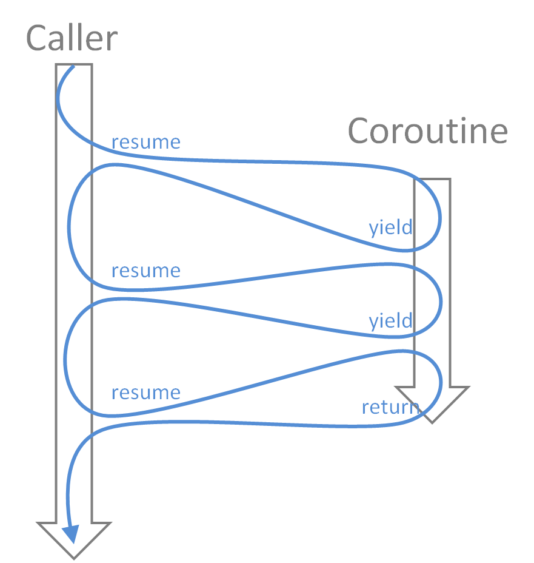
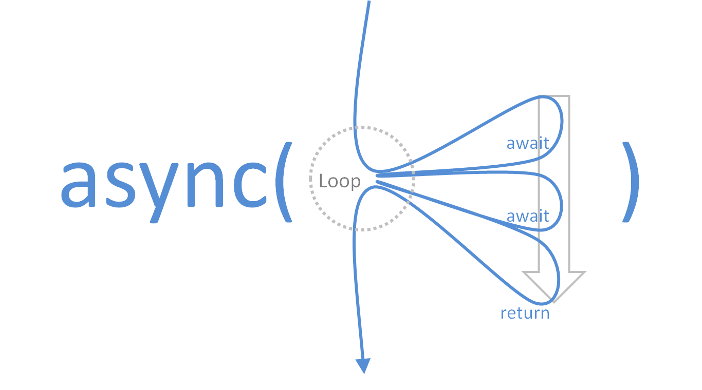

# Paradigm shift: from coroutines, callbacks to asynchronous

[English Version](README.md) | [Chinese Version](README_zhCN.md)

Coroutines, callbacks, and asyncs are not difficult to explain separately, but the relationship between them is very brain-burning, and I haven't seen any article that can explain it clearly, so here I try to explain it with the simplest idea: how to convert coroutines and callbacks to the popular async/await pattern, I use lua 5.1 to explain.

Q: Why don't you use ecmascript? <br>
A: Because I think the promise-based implementation of ES complicates the problem, and it uses recursion instead of loops, and recursion has the risk of stack overflow.

First of all, what is a coroutine? The normal function returns after the end, but in the coroutine you can also use yield to return to the caller, the coroutine does not end, but goes to sleep, after which the caller can wake it up again and continue to execute from the last yield position. So some people compare coroutines to threads, just like Windows 3.1's collaborative multitasking and Windows 95's preemptive multitasking.



So what is the relationship between coroutines and async/await patterns? The first thing that comes to mind is, will await be yield? That's right, in lua, I directly define `await = coroutine.yield`. Then the biggest problem is that yield is returned to the caller, while await is returned to the left of the equal sign. This is where a paradigm shift is needed: resume can pass value to the coroutine, and yield can pass value to the caller, so wouldn't the caller just pass the received value back to the coroutine? This loops the resume coroutine until it is dead. In a word, wrapping a function as a coroutine and then wrapping it around a layer of loops is asynchronize.



The code is as follows, and for simplicity, error handling is not included:

```
function async(f)
    return function(...)
        local co = coroutine.create(f)
        local ret = {true, ...}
        while coroutine.status(co) ~= 'dead' do
            ret = {coroutine.resume(co, unpack(ret, 2))}
        end
        return unpack(ret, 2)
    end
end
await = coroutine.yield
```

Q: It's as simple as that? <br>
A: Yes, it's as simple as that.

For example, the following code:

```
local add =
    async(
    function(a, b)
        return a + b
    end
)
local function mul(a, b)
    return a * b
end
local main =
    async(
    function()
        local c, d = await(add(1, 2), 3 + 4)
        local e = await(mul(c, d))
        print(c, d, e)
    end
)
main()
```

Q: Why can the main function be executed directly? <br>
A: The essence after asynchronize is a function, not a coroutine, so it can be executed directly.

Q: Why can I put ordinary functions or expressions in await? <br>
A: The essence of await is to pass parameters, so the parameters in parentheses must be calculated first, so as to ensure the sequential execution from the mechanism.

Q: What is the difference between a normal function and an asynchronized function? <br>
A: The magic of asynchronize is that it looks like a function on the outside, but inside it is a coroutine environment, which is necessary to use await.

Q: There is no asynchronous code in your example? <br>
A: That's right, the async/await pattern just provides a framework that can be executed in the order of the code, including coroutines, and there is no magic of asynchronous execution in itself. The underlying layer of any asynchronous must be a callback function, and only a callback function can disrupt the execution order. Coroutines can be used to accomplish conversions, and here are some examples:

```
local function callback_example(a, b, cb)
    cb('Greetings ' .. a .. ' and ' .. b)
end
local function callback_removed(a, b)
    local co = coroutine.running()
    local done
    local ret
    callback_example(
        a,
        b,
        function(...)
            -- A
            done = true
            ret = {...}
            if coroutine.status(co) == 'suspended' then
                coroutine.resume(co)
            end
        end
    )
    -- B
    if not done then
        coroutine.yield()
    end
    return unpack(ret)
end
```

callback_removed is a non-callback-style function after the transformation. Note: First of all, it is an ordinary function, not a coroutine; Second, it uses the coroutine context internally, so it must be executed within the coroutine. Note the comments A and B positions in the code, the key point is that because the callback_example is asynchronous, it is unknown whether A or B is executed first, the code uses a closure to set the state variable, and at B to make a judgment that if the callback function has not been executed, the coroutine will be hibernated, and at the end of the callback function the coroutine will be woken.

callback_removed can be directly wrapped as a coroutine execution: `print(coroutine.resume(coroutine.create(callback_removed), 'tom', 'jerry'))`

Of course, it can also be called by await, because await essentially executes the function:

```
local main =
    async(
    function()
        print(await(callback_removed('tom', 'jerry')))
        print(await(callback_removed('foo', 'bar')))
    end
)
main()
```

Reference:

- [From Javascript Callbacks to Promises to Generators and Coroutines
](https://cscrunch.com/content/javascript-callbacks-promises-generators-and-coroutines)
- [Using coroutines in Neovim Lua
](https://gregorias.github.io/posts/using-coroutines-in-neovim-lua/)