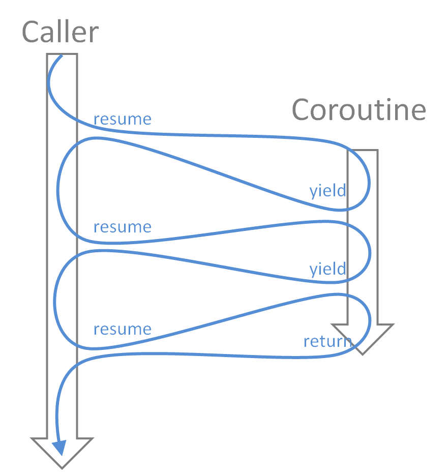

# 范式转移：从协程、回调到异步

[英文版](README.md) | [中文版](README_zhCN.md)

协程、回调和异步每一个单独拎出来讲都不难，但它们之间的关系却非常烧脑，迄今为止我还没见过哪篇文章能讲清楚的，所以在这里我尝试用最简单的思路讲解清楚：如何把协程和回调转换到流行的async/await模式，我使用lua 5.1讲解。

Q：为什么不用ecmascript？<br>
A：因为我认为es的那套基于promise的实现把问题复杂化了，而且其中用的是递归而非循环，递归有栈溢出的风险。

首先，什么是协程？正常函数return之后就结束了，但在协程里面还可以使用yield回到调用方，协程并未结束，而是进入睡眠状态，之后调用方可再次唤醒它并从上次yield位置继续往后执行。所以也有人把协程比作线程的，就好像windows 3.1的协作式多任务和windows 95的抢占式多任务。



那么协程和async/await模式有什么关联呢？首先能想到的，await会不会就是yield？没错，在lua里，我直接定义`await = coroutine.yield`。然后最大的问题是yield是返回到调用方，而await是返回给等号左边。这里就需要范式转移了：resume可以传值给协程，而yield可以传值给调用方，那么调用方把接收到的值原封不动传回协程不就是了？如此循环resume协程直到其dead为止。一句话，把函数包裹为协程，再包裹一层循环，就是异步化。


代码如下，为了简单起见，不包含错误处理：

```
function async(f)
    return function(...)
        local co = coroutine.create(f)
        local ret = {true, ...}
        while coroutine.status(co) ~= 'dead' do
            ret = {coroutine.resume(co, unpack(ret, 2))}
        end
        return unpack(ret, 2)
    end
end
await = coroutine.yield
```

Q：就这么简单？<br>
A：对，就这么简单。

比如下面的代码：

```
local add =
    async(
    function(a, b)
        return a + b
    end
)
local function mul(a, b)
    return a * b
end
local main =
    async(
    function()
        local c, d = await(add(1, 2), 3 + 4)
        local e = await(mul(c, d))
        print(c, d, e)
    end
)
main()
```

Q：为什么main函数可以直接执行？<br>
A：异步化后的本质就是函数，而不是协程，所以可以直接执行。

Q：为什么在await里面可以放普通函数或表达式？<br>
A：await的本质是传参，所以括号内的参数都是必须先计算出结果的，这样就从机制上确保了顺序执行。

Q：那么普通函数和异步化后的函数有什么区别？<br>
A：异步化的魔力在于外部看是函数，但内部是协程环境，是使用await所必须的。

Q：在你的示例里没有异步执行的代码啊？<br>
A：没错，async/await模式只是提供一个能够依照代码的顺序执行的框架，包括协程，本身都没有异步执行的魔法。任何异步的底层一定都是回调函数，只有回调函数才能打乱执行顺序。借助协程可完成转换，以下是范例：

```
local function callback_example(a, b, cb)
    cb('Greetings ' .. a .. ' and ' .. b)
end
local function callback_removed(a, b)
    local co = coroutine.running()
    local done
    local ret
    callback_example(
        a,
        b,
        function(...)
            -- A
            done = true
            ret = {...}
            if coroutine.status(co) == 'suspended' then
                coroutine.resume(co)
            end
        end
    )
    -- B
    if not done then
        coroutine.yield()
    end
    return unpack(ret)
end
```

callback_removed是转换后的非回调风格的函数。注意：首先它是普通函数，不是协程；其次它内部使用了协程上下文，所以必须在协程内执行。注意看代码里的注释A和B位置，关键点在于，因为callback_example是异步的，所以到底是A处还是B处先执行是未知的，代码使用闭包设置状态变量，在B处做判断如果回调函数尚未执行，则休眠协程，而在回调函数最后则唤醒协程。

callback_removed可直接包裹为协程执行：`print(coroutine.resume(coroutine.create(callback_removed), 'tom', 'jerry'))`

当然也可以由await调用，因为await本质就是执行该函数：

```
local main =
    async(
    function()
        print(await(callback_removed('tom', 'jerry')))
        print(await(callback_removed('foo', 'bar')))
    end
)
main()
```

参考：

- [From Javascript Callbacks to Promises to Generators and Coroutines
](https://cscrunch.com/content/javascript-callbacks-promises-generators-and-coroutines)
- [Using coroutines in Neovim Lua
](https://gregorias.github.io/posts/using-coroutines-in-neovim-lua/)